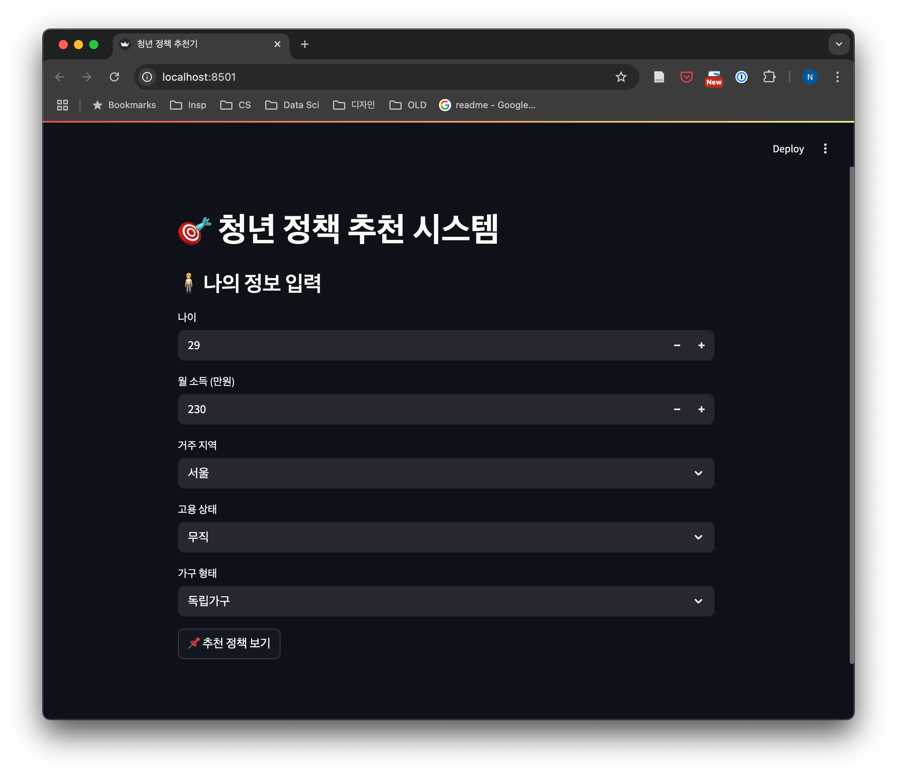
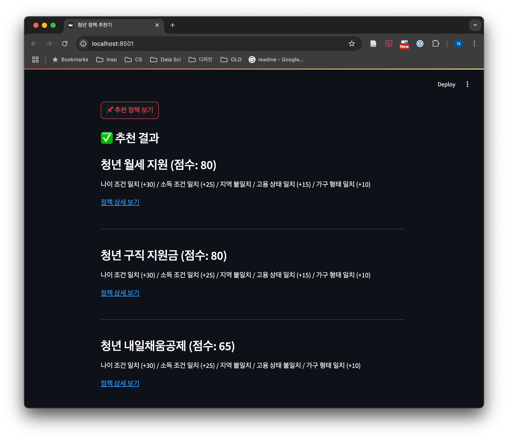

# 🎯 청년 정책 추천 시스템 (Youth Policy Recommender)

🇰🇷 대한민국 청년들을 위한 맞춤형 정책 추천 시스템입니다.  
사용자의 나이, 소득, 지역, 고용 상태 등을 바탕으로 받을 수 있는 정책을 점수화하여 추천하고,  
그 이유까지 함께 제공합니다.

### 사용자 입력 화면


### 추천 결과 화면



---

## 🔍 기능 소개

- ✅ 사용자 입력 기반 정책 추천 (Streamlit UI)
- ✅ 추천 점수 및 추천 이유 출력
- ✅ 정책 정보: 이름, 조건, 링크 포함
- ✅ Python 기반 추천 알고리즘 + CSV 정책 데이터
- 🔜 API 자동 수집, dbt 모델링, Airflow 파이프라인 예정


## 🛠 사용 기술 (Tech Stack)

| 카테고리 | 기술 |
|----------|------|
| 언어 | Python (Pandas, Streamlit) |
| 추천 알고리즘 | 커스텀 스코어링 로직 |
| 데이터 전처리 | Pandas / (향후 dbt) |
| UI | Streamlit |
| 구조화 | 프로젝트 폴더 분리, 모듈화 (`scripts/`, `streamlit_app/`) |


## 📁 프로젝트 구조 
```bash
├── data/
│   └── sample_policies_utf8bom.csv  # 정책 예제 데이터
├── scripts/
│   └── recommender.py               # 추천 로직
├── streamlit_app/
│   └── app.py                       # Streamlit UI
├── requirements.txt
└── README.md
```


## 🚀 실행 방법

### 1. 설치
```bash
git clone https://github.com/yourname/youth-policy-recommender.git
cd youth-policy-recommender
pip install -r requirements.txt
```
### 2. 실행
```bash
streamlit run streamlit_app/app.py
```

## ✨ 예시 결과
> 청년 월세 지원 (점수: 80)
나이 조건 일치 (+30) / 소득 조건 일치 (+25) / 고용 상태 일치 (+15) / 가구 형태 일치 (+10)


## 🔮 향후 개선 사항
 - 정책 API 자동 수집 (온통청년, 공공데이터포털)
 - dbt 기반 정책 조건 마트 모델링
 - Airflow 자동화 파이프라인
 - Streamlit 배포 (Cloud / Hugging Face Spaces)


🙋‍♀️ 개발자 @namikimlab
